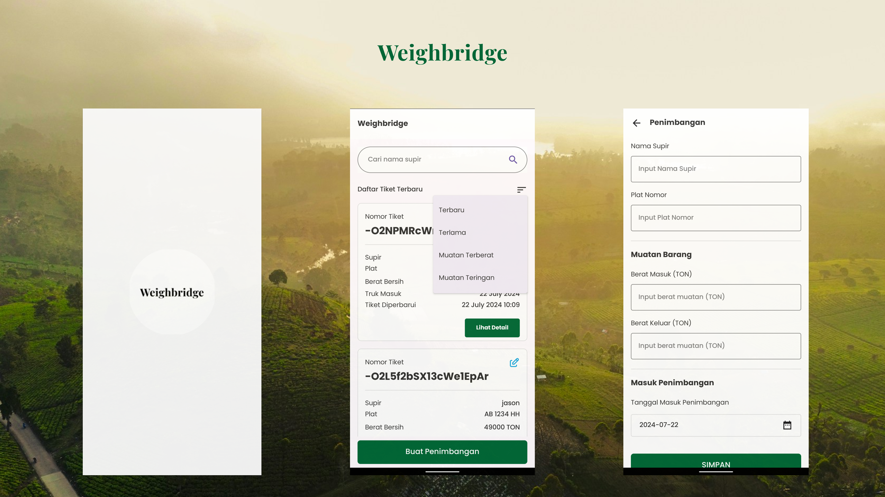

# Weighbridge App

## Overview
-----------

The Weighbridge App is an Android application that records truck's inbound and outbound weight through a weighbridge. The app allows users to create, edit, and view weighbridge tickets, which contain information such as date and time, license number, driver name, inbound and outbound weight, and net weight.

## Features
------------

* Create weighbridge tickets
* Update weighbridge tickets
* View list of weighbridge tickets with sorting options and search driver name
* Display detailed information of each weighbridge ticket
* Uses MVVM architecture and Android Jetpack library

## Build With
-------------------------
* Kotlin
* Jetpack Compose
* Koin
* Firebase
* Mockito
* Material Design 3
* Flow
* Live Data

## Technical Requirements
-------------------------

* Android 5.0 (API 21) or higher
* Java OpenJDK version 17.0.8
* Gradle version 8.1.1
* Kotlin 1.8.10

## Testing
---------

1. Run unit tests: `./gradlew test`
2. Run instrumentation tests: `./gradlew connectedAndroidTest`

## Acknowledgments
---------------

* Firebase Realtime Database for online storage
* Android Jetpack library for MVVM architecture
* Kotlin Coroutines for asynchronous tasks

## Contact
---------

If you have any questions or issues, please contact [umar syaid himawan](mailto:himawan.masyaid@gmail.com).
